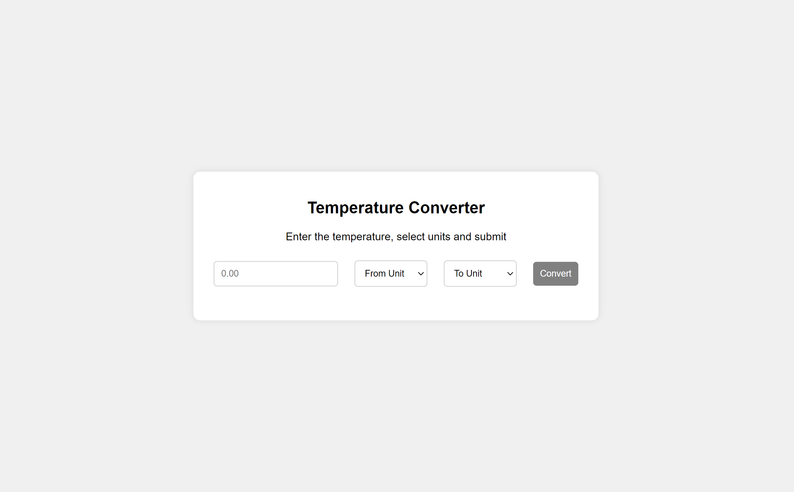

# Temperature Converter

## Description

The **Temperature Converter** is a simple web-based tool to convert temperatures between Celsius, Fahrenheit, and Kelvin. It helps practice **DOM manipulation**, **form handling**, and **basic calculations** in JavaScript. The "Convert" button is enabled only when all fields are filled, and the converted result is displayed instantly.

Inspired by the [Temperature Converter](https://roadmap.sh/projects/temperature-converter) on roadmap.sh.

## Features

- Convert between Celsius, Fahrenheit, and Kelvin.
- Real-time feedback after conversion.
- Clean and responsive UI.

## Visuals



## Badges


## Installation

1. Clone the repository:
   ```bash
   git clone https://github.com/Yashi-Singh-9/Temperature-Converter.git
   ```

2. Open the `index.html` file in your browser to start using the app.

## Usage
1. Enter a temperature.
2. Select the unit to convert from and to.
3. Click "Convert" to view the result.

## License
This project is licensed under the MIT License. See the [LICENSE](LICENSE) file for details.

## Authors
Developed by **Yashi Singh**.
